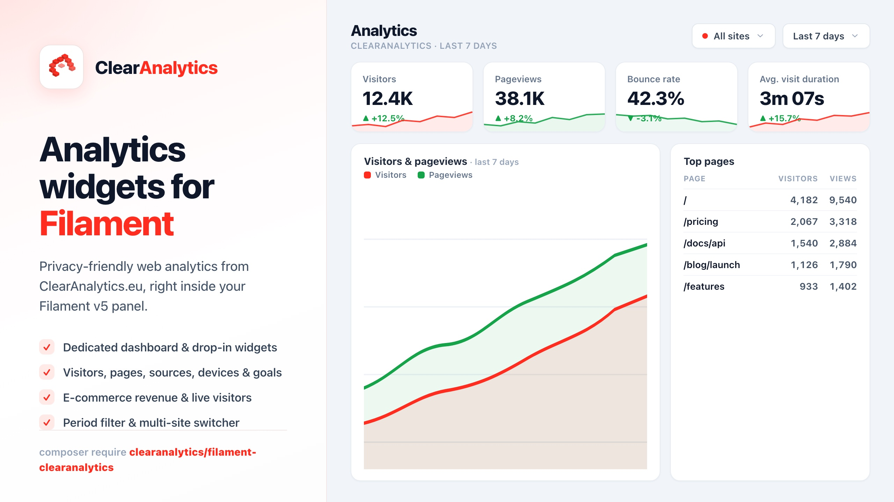

# Filament ClearAnalytics



[](https://php.net)
[](https://filamentphp.com)

Display your [ClearAnalytics.eu](https://clearanalytics.eu) web-analytics inside a
Filament v5 panel — a dedicated **Analytics** dashboard plus a set of plug-and-play
widgets (visitors, pageviews, bounce rate, top pages, referrers, devices,
e-commerce revenue, goals and more).

It talks to the official ClearAnalytics REST API, so your panel never touches
raw tracking data — it just reads aggregated stats over HTTPS.

> Inspired by [`bezhanSalleh/filament-google-analytics`](https://github.com/bezhanSalleh/filament-google-analytics),
> but powered by ClearAnalytics instead of Google Analytics. **Filament v5 only.**

## Features

- 📊 **Dedicated dashboard page** with a period filter (24h / 7d / 30d / 90d / 12m
  or a custom date range) and a **site switcher** for multi-site accounts.
- 🧩 **Widgets**: overview stat cards (with trend + sparkline), visitors/pageviews
  chart, top pages, top referrers, traffic sources, devices, browsers, operating
  systems, languages and campaigns.
- 🛒 **E-commerce** (optional): revenue stat cards, revenue chart, top products and
  a conversion funnel.
- 🎯 **Goals** (optional) and a **live visitors** widget.
- ⚡ **Cached** API calls to stay within the ClearAnalytics rate limit
  (60 req/min), with graceful empty states when the API is unreachable.
- 🌍 English & Dutch translations included; everything is publishable.

## Requirements

- PHP 8.2+
- Laravel 11, 12 **or 13**
- Filament v5
- A ClearAnalytics account on a plan with **API access**, and an API token
  (Settings → API Tokens).

## Installation

```bash
composer require clearanalytics/filament-clearanalytics
```

Optionally publish the config and translations:

```bash
php artisan vendor:publish --tag="clear-analytics-config"
php artisan vendor:publish --tag="clear-analytics-translations"
```

<details>
<summary>Installing from a local checkout (development)</summary>

Add a path repository to your app's `composer.json`, then require the package:

```json
"repositories": [
    {
        "type": "path",
        "url": "/absolute/path/to/filament-clearanalytics",
        "options": { "symlink": true }
    }
]
```

```bash
composer require "clearanalytics/filament-clearanalytics:@dev"
```

The symlink means edits to the package are reflected in your app immediately.
</details>

## Configuration

Add your API token (and, optionally, a default site) to `.env`:

```dotenv
CLEARANALYTICS_API_TOKEN=your-api-token
# Optional: limit to one site. Leave empty to show the aggregate of all sites.
CLEARANALYTICS_SITE_ID=01JM...
# Optional overrides:
CLEARANALYTICS_BASE_URL=https://clearanalytics.eu/api/v1
CLEARANALYTICS_PERIOD=7d
CLEARANALYTICS_CACHE_TTL=300
```

Register the plugin in your panel provider:

```php
use ClearAnalytics\Filament\ClearAnalyticsPlugin;

public function panel(Panel $panel): Panel
{
    return $panel
        // ...
        ->plugin(ClearAnalyticsPlugin::make());
}
```

That's it — an **Analytics** item appears in your panel navigation.

### Per-panel configuration

Everything in the config file can be overridden fluently:

```php
->plugin(
    ClearAnalyticsPlugin::make()
        ->token(env('CLEARANALYTICS_API_TOKEN'))
        ->site('01JM...')        // default site id
        ->defaultPeriod('30d')
        ->cacheTtl(600)
        ->ecommerce(true)        // toggle the e-commerce widgets
        ->goals(true)            // toggle the goals widget
        ->live(false)            // toggle the live-visitors widget
        ->registerOnDashboard()  // also push selected widgets onto the panel's main dashboard
)
```

### Showing widgets on your own dashboard

By default the widgets live on the dedicated **Analytics** page. To also show a
subset on the panel's main dashboard, set `register_on_dashboard => true` and flip
the per-widget booleans in `config/clear-analytics.php` (`widgets` array), or call
`->registerOnDashboard()->widgets(['top_pages' => true, ...])`.

You can also drop any widget into your own page manually:

```php
use ClearAnalytics\Filament\Widgets\OverviewStatsWidget;

protected function getHeaderWidgets(): array
{
    return [OverviewStatsWidget::class];
}
```

Widgets rendered outside the dedicated dashboard use the default period and site
from your config.

## How it works

All data comes from the ClearAnalytics REST API (`/api/v1`). The
`ClearAnalytics\Filament\ClearAnalytics` service wraps each endpoint, authenticates
with your Bearer token, caches responses, and unwraps the `{ "data": ... }`
envelope. You can use it directly too:

```php
use ClearAnalytics\Filament\Facades\ClearAnalytics;

$overview = ClearAnalytics::overview(['period' => '30d', 'site_id' => '01JM...']);
$topPages = ClearAnalytics::pages(['period' => '7d', 'limit' => 20]);
```

## Testing

```bash
composer install
vendor/bin/pest
vendor/bin/phpstan analyse --memory-limit=512M
vendor/bin/pint --test
```

## Credits

A product of **[Coding Agency](https://coding.agency?utm_source=github&utm_medium=readme&utm_campaign=filament-clearanalytics)** — custom software from Meppel, the Netherlands.

## License

MIT.
